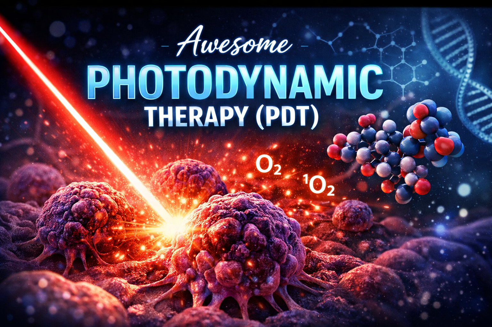

<p align="center">
  
</p>

<p align="center">
  <em>Photodynamic Therapy — light-based technologies at the forefront of modern medicine</em>
</p>

<p align="center">
  
  
  
  
  
</p>

# 🌟 Awesome Photodynamic Therapy (PDT)


A curated, open-source collection of **photodynamic therapy (PDT)** knowledge,
clinical protocols, calculators, bots, and digital tools for medical professionals.

> **Photodynamic Therapy Toolkit** — a practical ecosystem for clinicians,
engineers, and researchers working with PDT.
# 🩺 Photodynamic Therapy Toolkit (PDT)

**Awesome Photodynamic Therapy (PDT)** — это открытая коллекция знаний, клинических материалов и цифровых инструментов для специалистов по фотодинамической терапии.

Проект объединяет:
- клинические протоколы ФДТ
- расчётные формулы и калькуляторы
- ботов и микросервисы для врачей
- образовательные и справочные материалы

🎯 Цель проекта — повысить точность, безопасность и удобство работы врача ФДТ с помощью цифровых инструментов.

---

## 🚀 Quick Start (для новичков)

Если вы:
- врач
- ординатор
- инженер в медицине
- исследователь ФДТ  

👉 начните с этих разделов:

- 📘 **Basics & Theory** — основы ФДТ
- 🧮 **Calculators** — расчёты доз, энергии, экспозиции
- 🤖 **Bots & Tools** — Telegram-боты и сервисы
- 🧾 **Protocols** — клинические протоколы и формы

---

## 🧠 Структура репозитория

basics → основы и теория ФДТ
/protocols → клинические протоколы
/calculators → формулы и калькуляторы ФДТ
/bots → Telegram-боты и сервисы
/forms → медицинские формы и шаблоны
/research → статьи, ссылки, исследования
/docs → документация проекта


---

## 🧮 Поддерживаемые расчёты

- Доза (Дж/см²)
- Мощность излучения
- Площадь воздействия
- Время экспозиции
- Диапазоны 200–400 Дж/см²
- Клинические формулы по протоколам ФДТ

⚠️ Все расчёты предназначены **для профессионального использования**.

---

## 🤖 Цифровые инструменты

- **FDT Calculator (Telegram Bot)**
- Генерация форм и протоколов
- Автоматизация подготовки процедуры
- JSON / PDF output

> Инструменты не заменяют врача, а помогают снизить риск ошибок.

---

## 🧩 Уровни сложности

Материалы помечаются по уровню:
- 🟢 Beginner — базовые знания
- 🟡 Intermediate — клиническая практика
- 🔴 Advanced — инженерия и автоматизация

---

## 🤝 Вклад в проект (Contributing)

Мы приветствуем:
- врачей ФДТ
- медицинских инженеров
- разработчиков
- исследователей

📌 Пожалуйста, ознакомьтесь с `CONTRIBUTING.md` перед созданием PR.

---

## Project Structure

- `resources/` — contains media files, images, and other therapy resources.
- `bots/` — contains bot scripts and modules for FDT and other automation.
- `protocols/` — contains medical algorithms, protocols, and reference guides.
- `docs/` — additional documentation, guides, and references.

## Setup / Installation

1. Clone the repo:
   ```bash
   git clone https://github.com/rolloerro/Awesome-Photodynamic-Therapy-PDT-.git


## ⚠️ Дисклеймер

Материалы проекта:
- не являются медицинской рекомендацией
- не заменяют клиническое мышление врача
- используются **на ответственность специалиста**

---

## 📬 Контакты

Автор проекта:  
**Vladimir Kopylov**  
ФДТ, медицинские цифровые системы  

- GitHub: https://github.com/rolloerro
- Telegram: @MSL72Rph

---

🧠 *Photodynamic Therapy Toolkit — когда медицина и технологии работают вместе.*

